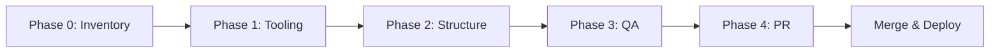

# Phase 0: Repository Inventory and Reorganization Plan

**Date:** 2025-09-29 **Lead Maintainer:** Phase 0 Strategic Planning Agent
**Repository:** Neo-Brutalist 11ty Theme

---

## Executive Summary

This document provides a comprehensive inventory of the Neo-Brutalist 11ty Theme
repository and outlines a phased approach (Phases 1-4) for cleanup,
reorganization, and hardening. The goal is to create a **boringly excellent**,
theme-first repository with clean structure, accurate documentation, fast CI,
and zero vestigial content.

**Key Metrics:**

- **Total Size:** ~113 MB (62 MB in node_modules)
- **Vestigial Content:** ~52 MB (test artifacts, automation state)
- **Documentation:** 8 MD files at root (~2,188 lines)
- **Configuration Files:** 9+ config files (some duplicates)
- **Test Files:** 6 consolidated specs + backup artifacts
- **Build Artifacts:** 732 KB (\_site directory)

---

## 1. CURRENT STATE INVENTORY

### 1.1 Top-Level Directory Structure

#### **Production/Theme Directories** (KEEP)

```
src/                        492 KB    Theme source code (templates, CSS, JS, content)
├── _data/                           Site configuration and metadata
├── _includes/                       Components, layouts, partials
├── assets/                          CSS, JS, images
├── pages/                           Static pages
├── posts/                           Blog content (7 articles)
├── projects/                        Project showcases (4 projects)
└── blog/                            Blog listing page

example/                    24 KB     Minimal demo site
├── src/                             Example implementation
├── .eleventy.js                     Example config
├── package.json                     Example dependencies
└── README.md                        Usage instructions

docs/                       216 KB    Documentation (19 MD files)
├── advanced/                        Deep-dive documentation
├── FINAL_VALIDATION_REPORT.md
├── LIVE_SITE_VALIDATION.md
├── MOBILE_FIX_REPORT.md
└── [16 other report files]
```

#### **Development/Testing Directories** (KEEP with cleanup)

```
tests/                      36 MB     Test suite (mostly artifacts)
├── consolidated-*.spec.js           6 active test files
├── links.spec.js                    Link validation
├── helpers/                         Test utilities
├── backup/                          Old test files (DELETE?)
├── screenshots/                     Test screenshots
└── test-results/          7.2 MB    Test execution artifacts (DELETE)

.github/                    4 KB      CI/CD workflows
└── workflows/
    ├── deploy.yml                   GitHub Pages deployment
    └── playwright.yml               Test automation

scripts/                    4 KB      Utility scripts
├── create-apple-icon.py            Icon generation
└── create-favicon.py               Favicon generation
```

#### **Build/Cache Directories** (IGNORED/DELETE)

```
_site/                      732 KB    Build output (GITIGNORED)
node_modules/               62 MB     Dependencies (GITIGNORED)
playwright-report/          25 MB     Test reports (DELETE - vestigial)
test-results/              7.2 MB     Test artifacts (DELETE - vestigial)
.playwright-mcp/            17 MB     Test screenshots (ARCHIVE/DELETE)
```

#### **Automation State Directories** (PRESERVE but IGNORE)

```
.claude/                    ~4 KB     Claude Code agent definitions
├── agents/                          54+ agent definitions
├── checkpoints/                     Session checkpoints
├── commands/                        Custom commands
├── helpers/                         Helper scripts
└── settings.json                    Configuration

.hive-mind/                1.4 MB     Hive mind coordination (SQLite DBs)
├── hive.db                          Main coordination database
├── memory.db                        Memory storage
├── sessions/                        Session data
├── logs/                            Operation logs
└── config.json                      Configuration

.swarm/                     920 KB    Swarm coordination (SQLite DBs)
└── memory.db                        Swarm memory

.claude-flow/               4 KB      Claude Flow configuration
memory/                     24 KB     Claude Flow memory
coordination/               16 KB     Task coordination
```

#### **Hidden Config Directories** (KEEP)

```
.git/                       ~40 MB    Git repository
.github/                    4 KB      GitHub Actions workflows
```

### 1.2 Configuration Files Inventory

#### **Core Configuration** (KEEP - Single Source of Truth)

```
.eleventy.js                5.2 KB    11ty configuration ✅ PRIMARY
package.json                2.5 KB    Dependencies and scripts ✅ PRIMARY
package-lock.json           106 KB    Dependency lock ✅ PRIMARY
playwright.config.js        3.6 KB    Playwright config ✅ PRIMARY (root)
```

#### **Linting/Formatting Configuration** (KEEP)

```
.eslintrc.js                3.4 KB    ESLint rules ✅ PRIMARY
.eslintignore               515 B     ESLint exclusions ✅ NEEDS UPDATE
.prettierrc                 1.0 KB    Prettier config ✅ PRIMARY
.prettierignore             433 B     Prettier exclusions ✅ NEEDS UPDATE
```

#### **Ignore Files** (KEEP - UPDATE NEEDED)

```
.gitignore                  1.1 KB    Git exclusions ✅ GOOD (has .claude/)
.npmignore                  737 B     NPM package exclusions ⚠️ NEEDS .claude/
.repomixignore              490 B     Repomix exclusions ✅ REFERENCE ONLY
```

#### **Other Config Files** (REVIEW)

```
.mcp.json                   503 B     MCP server config ⚠️ DOCUMENT PURPOSE
```

#### **Duplicate/Redundant Configs** (DELETE)

```
tests/playwright.config.js.bak  1 KB  ❌ DELETE - backup file
```

### 1.3 Documentation Files Analysis

#### **Root-Level Documentation** (8 files, 2,188 total lines)

| File            | Size   | Lines | Status     | Action                   |
| --------------- | ------ | ----- | ---------- | ------------------------ |
| README.md       | 6.3 KB | ~175  | ✅ KEEP    | Consolidate as primary   |
| CLAUDE.md       | 28 KB  | ~734  | ✅ KEEP    | Reference for automation |
| QUICK-START.md  | 3.7 KB | ~96   | ⚠️ MERGE   | Merge into README        |
| CONTRIBUTING.md | 6.7 KB | ~175  | ✅ KEEP    | Standard file            |
| TESTING.md      | 7.8 KB | ~203  | ⚠️ MOVE    | Move to docs/advanced/   |
| PROGRESS.md     | 9.7 KB | ~253  | ⚠️ ARCHIVE | Move to docs/ or DELETE  |
| NOTICE.md       | 1.8 KB | ~47   | ✅ KEEP    | License notices          |
| cleanup.md      | 7.2 KB | ~187  | ❌ DELETE  | Obsolete prompt          |
| LICENSE         | 1.1 KB | ~21   | ✅ KEEP    | Required                 |

**Documentation Inventory:**

- **Total:** 2,188 lines across 8 files
- **Redundancy:** QUICK-START.md overlaps with README.md
- **Outdated:** cleanup.md is a swarm prompt, not user docs
- **Misplaced:** TESTING.md should be in docs/advanced/

#### **docs/ Directory** (19 files, ~216 KB)

**Reports (Should be archived or deleted):**

```
docs/ANALYSIS_REPORT.md                 ⚠️ ARCHIVE (historical)
docs/ARCHITECTURE_RATIONALE.md          ⚠️ MOVE to advanced/
docs/CLEANUP-REPORT.md                  ❌ DELETE (obsolete)
docs/COMPREHENSIVE-LINK-TEST-REPORT.md  ❌ DELETE (test artifact)
docs/CONSOLIDATION_SUMMARY.md           ❌ DELETE (obsolete)
docs/DEPENDENCY_VULNERABILITIES.md      ⚠️ ARCHIVE (historical)
docs/FINAL_VALIDATION_REPORT.md         ⚠️ KEEP (recent validation)
docs/LIVE_SITE_VALIDATION.md            ⚠️ KEEP (deployment validation)
docs/MIGRATION_PLAN.md                  ❌ DELETE (obsolete)
docs/MOBILE_FIX_REPORT.md               ⚠️ KEEP (recent fix)
docs/NEW_ARCHITECTURE.md                ⚠️ MOVE to advanced/
docs/PR_DESCRIPTION.md                  ❌ DELETE (ephemeral)
docs/SAST_REPORT.md                     ⚠️ ARCHIVE (security scan)
docs/SECURITY_FIXES_REPORT.md           ⚠️ ARCHIVE (historical)
docs/STYLE_GUIDE.md                     ✅ KEEP (move to advanced/)
docs/TEST_CONSOLIDATION_REPORT.md       ❌ DELETE (obsolete)
docs/VIEWPORT_TEST_REPORT.md            ⚠️ KEEP (test validation)
docs/mobile-responsiveness-report.md    ⚠️ KEEP (implementation notes)
```

**Current Structure:**

```
docs/
├── advanced/                           ✅ KEEP (proper location)
│   ├── ADVANCED_CUSTOMIZATION.md
│   └── DEPLOYMENT_STRATEGIES.md
└── [18 report files]                   ⚠️ REORGANIZE
```

**Recommended Structure:**

```
docs/
├── advanced/                           Deep-dive documentation
│   ├── ARCHITECTURE.md                 (from ARCHITECTURE_RATIONALE.md)
│   ├── CUSTOMIZATION.md                (existing)
│   ├── DEPLOYMENT.md                   (existing)
│   ├── TESTING.md                      (from root TESTING.md)
│   └── STYLE_GUIDE.md                  (from docs/)
├── reports/                            Historical reports (archived)
│   ├── 2025-09-29-validation.md        (FINAL_VALIDATION_REPORT.md)
│   ├── 2025-09-29-mobile-fix.md        (MOBILE_FIX_REPORT.md)
│   └── security-audit-2025-09.md       (SAST_REPORT.md)
└── [DELETE obsolete reports]
```

### 1.4 Test Assets and Structure

#### **Active Test Files** (KEEP)

```
tests/consolidated-accessibility.spec.js    25 KB    ✅ ACTIVE
tests/consolidated-comprehensive.spec.js    28 KB    ✅ ACTIVE
tests/consolidated-navigation.spec.js       14 KB    ✅ ACTIVE
tests/consolidated-performance.spec.js      22 KB    ✅ ACTIVE
tests/consolidated-social-icons.spec.js     16 KB    ✅ ACTIVE
tests/links.spec.js                         10 KB    ✅ ACTIVE
tests/helpers/                                       ✅ UTILITIES
tests/global-setup.js                       1.4 KB   ✅ CONFIG
tests/README.md                             8 KB     ✅ DOCUMENTATION
```

#### **Test Artifacts** (DELETE/ARCHIVE)

```
tests/backup/                               ⚠️ ARCHIVE (old tests)
tests/screenshots/                          ⚠️ KEEP (gitignored)
tests/test-results/                         ❌ DELETE (build artifacts)
test-results/ (root)                        ❌ DELETE (7.2 MB artifacts)
playwright-report/ (root)                   ❌ DELETE (25 MB reports)
.playwright-mcp/                            ⚠️ REVIEW (17 MB screenshots)
```

**Duplicate Configuration:**

```
tests/playwright.config.js.bak              ❌ DELETE (backup)
playwright.config.js (root)                 ✅ PRIMARY
```

### 1.5 Build Artifacts and Vestigial Content

#### **Git Staging (Deleted Files)**

```
test-backup/*.spec.js                       27 files    ❌ ALREADY DELETED
out.txt                                                  ❌ ALREADY DELETED
project_plan.md                                          ❌ ALREADY DELETED
repomix-output.xml                                       ❌ ALREADY DELETED
```

#### **Untracked Files** (Need Decision)

```
.playwright-mcp/.playwright-mcp/            17 MB       ⚠️ NESTED DUPLICATE?
cleanup.md                                  7.2 KB      ❌ DELETE
docs/FINAL_VALIDATION_REPORT.md                         ⚠️ KEEP (recent)
docs/LIVE_SITE_VALIDATION.md                            ⚠️ KEEP (recent)
docs/MOBILE_FIX_REPORT.md                               ⚠️ KEEP (recent)
```

#### **Build Outputs** (Properly Ignored)

```
_site/                                      732 KB      ✅ GITIGNORED
node_modules/                               62 MB       ✅ GITIGNORED
```

#### **Automation State** (Partially Ignored)

```
.claude/                                    4 KB        ⚠️ NOT IN ALL IGNORES
.hive-mind/                                1.4 MB       ⚠️ PARTIAL IGNORE
.swarm/                                    920 KB       ⚠️ PARTIAL IGNORE
.claude-flow/                              4 KB         ⚠️ PARTIAL IGNORE
memory/                                    24 KB        ⚠️ PARTIAL IGNORE
coordination/                              16 KB        ⚠️ PARTIAL IGNORE
```

**Critical Issue:** `.claude/` and automation directories are NOT in:

- `.npmignore` ✅ (has .claude/)
- `.eslintignore` ❌ (MISSING .claude/)
- `.prettierignore` ❌ (MISSING .claude/)
- `playwright.config.js` ❌ (MISSING test ignore pattern)

---

## 2. PROPOSED STRUCTURE

### 2.1 Final Directory Layout

```
neo-brutalist-11ty-theme/
├── .claude/                    [PRESERVE] Claude Code agent definitions
│   └── [Never move/rename]     [IGNORED by all tools]
│
├── .github/                    [KEEP] CI/CD workflows
│   └── workflows/
│       ├── deploy.yml
│       └── playwright.yml
│
├── src/                        [KEEP] Theme source (shipped)
│   ├── _data/
│   ├── _includes/
│   ├── assets/
│   ├── pages/
│   ├── posts/
│   ├── projects/
│   ├── blog/
│   ├── index.njk
│   └── robots.txt
│
├── example/                    [KEEP] Demo site (shipped)
│   ├── src/
│   ├── .eleventy.js
│   ├── package.json
│   └── README.md
│
├── docs/                       [REORGANIZE] Documentation
│   ├── advanced/               Theme-first docs
│   │   ├── ARCHITECTURE.md
│   │   ├── CUSTOMIZATION.md
│   │   ├── DEPLOYMENT.md
│   │   ├── TESTING.md
│   │   └── STYLE_GUIDE.md
│   └── reports/                Historical reports (archived)
│       ├── 2025-09-validation/
│       └── security-audits/
│
├── tests/                      [CLEANUP] Test suite
│   ├── consolidated-*.spec.js  6 active tests
│   ├── links.spec.js
│   ├── helpers/
│   ├── global-setup.js
│   └── README.md
│
├── scripts/                    [KEEP] Utilities (not shipped)
│   ├── create-apple-icon.py
│   └── create-favicon.py
│
├── .eleventy.js                [KEEP] 11ty config (shipped)
├── package.json                [KEEP] Package manifest (shipped)
├── playwright.config.js        [KEEP] Test config (not shipped)
├── .eslintrc.js                [KEEP] Lint config (not shipped)
├── .prettierrc                 [KEEP] Format config (not shipped)
├── .gitignore                  [UPDATE] Git exclusions
├── .npmignore                  [UPDATE] Package exclusions
├── .eslintignore               [UPDATE] Lint exclusions
├── .prettierignore             [UPDATE] Format exclusions
├── README.md                   [CONSOLIDATE] Primary documentation
├── CONTRIBUTING.md             [KEEP] Contribution guide
├── TESTING.md                  [MOVE] → docs/advanced/TESTING.md
├── CLAUDE.md                   [KEEP] Automation reference
├── NOTICE.md                   [KEEP] License notices
└── LICENSE                     [KEEP] MIT license

[DELETE]
├── QUICK-START.md              → Merged into README.md
├── PROGRESS.md                 → Archived or deleted
├── cleanup.md                  → Deleted (obsolete prompt)
├── test-results/               → Deleted (artifacts)
├── playwright-report/          → Deleted (artifacts)
├── .playwright-mcp/            → Reviewed and cleaned
├── .hive-mind/                 → Gitignored (state)
├── .swarm/                     → Gitignored (state)
├── .claude-flow/               → Gitignored (state)
├── memory/                     → Gitignored (state)
└── coordination/               → Gitignored (state)
```

### 2.2 Files to KEEP (with Justification)

#### **Production Theme Files** (Shipped to NPM)

```
✅ src/**                       Core theme templates, styles, scripts
✅ .eleventy.js                 11ty configuration
✅ example/**                   Demo site for users
✅ README.md                    Primary user documentation
✅ LICENSE                      MIT license (required)
✅ NOTICE.md                    Third-party license notices
✅ docs/advanced/**             Deep-dive documentation
✅ package.json                 Dependencies and metadata
```

#### **Development Files** (Not Shipped)

```
✅ tests/**/*.spec.js           Test suite (6 consolidated tests)
✅ tests/helpers/               Test utilities
✅ tests/global-setup.js        Playwright setup
✅ .github/workflows/           CI/CD automation
✅ scripts/                     Development utilities
✅ playwright.config.js         Test configuration
✅ .eslintrc.js                 Linting rules
✅ .prettierrc                  Formatting rules
✅ .gitignore                   Git exclusions
✅ .npmignore                   Package exclusions
✅ CONTRIBUTING.md              Contribution guidelines
✅ CLAUDE.md                    Automation reference
```

#### **Automation State** (Preserved but Ignored)

```
✅ .claude/                     Claude Code agents (NEVER MOVE)
⚠️ .hive-mind/                  Coordination state (GITIGNORED)
⚠️ .swarm/                      Swarm state (GITIGNORED)
⚠️ .claude-flow/                Flow state (GITIGNORED)
⚠️ memory/                      Memory state (GITIGNORED)
⚠️ coordination/                Task state (GITIGNORED)
```

### 2.3 Files to MOVE (with Destination)

```
TESTING.md                      → docs/advanced/TESTING.md
docs/STYLE_GUIDE.md             → docs/advanced/STYLE_GUIDE.md
docs/ARCHITECTURE_RATIONALE.md  → docs/advanced/ARCHITECTURE.md
docs/NEW_ARCHITECTURE.md        → docs/advanced/ARCHITECTURE.md (merge)

docs/FINAL_VALIDATION_REPORT.md → docs/reports/2025-09-validation.md
docs/LIVE_SITE_VALIDATION.md    → docs/reports/2025-09-validation.md (merge)
docs/MOBILE_FIX_REPORT.md       → docs/reports/2025-09-mobile-fixes.md
docs/VIEWPORT_TEST_REPORT.md    → docs/reports/2025-09-mobile-fixes.md (merge)
docs/mobile-responsiveness-report.md → docs/reports/2025-09-mobile-fixes.md (merge)

docs/SAST_REPORT.md             → docs/reports/security/2025-09-sast.md
docs/SECURITY_FIXES_REPORT.md   → docs/reports/security/2025-09-fixes.md
docs/DEPENDENCY_VULNERABILITIES.md → docs/reports/security/2025-09-deps.md
```

### 2.4 Files to DELETE (with Reason)

#### **Obsolete Documentation**

```
❌ cleanup.md                   Swarm prompt, not user documentation
❌ QUICK-START.md               Redundant with README.md (merge content)
❌ PROGRESS.md                  Development notes, not user-facing
❌ docs/CLEANUP-REPORT.md       Obsolete cleanup report
❌ docs/CONSOLIDATION_SUMMARY.md Obsolete consolidation report
❌ docs/MIGRATION_PLAN.md       Obsolete migration plan
❌ docs/PR_DESCRIPTION.md       Ephemeral PR template
❌ docs/TEST_CONSOLIDATION_REPORT.md Obsolete test report
❌ docs/COMPREHENSIVE-LINK-TEST-REPORT.md Test artifact
```

#### **Build Artifacts and Test Reports**

```
❌ test-results/                7.2 MB test execution artifacts
❌ playwright-report/           25 MB HTML test reports
❌ tests/test-results/          Duplicate test artifacts
❌ tests/playwright.config.js.bak Backup configuration file
❌ .playwright-mcp/.playwright-mcp/ Nested duplicate directory (review)
```

#### **Already Deleted (Git Staging)**

```
✅ test-backup/*.spec.js        27 redundant test files
✅ out.txt                      Temporary output
✅ project_plan.md              Development planning doc
✅ repomix-output.xml           Build artifact
```

### 2.5 Files to REWRITE (with Scope)

#### **README.md** (Primary Documentation)

**Current:** 175 lines, basic structure **Needed:** Comprehensive single-source
documentation

**New Structure:**

```markdown
# Neo-Brutalist 11ty Theme

## Features (concise list)

## Installation

- NPM package
- Use as template
- Manual setup

## Quick Start

- Local development
- Configuration
- Content creation [MERGE CONTENT FROM QUICK-START.md]

## Configuration

- Site metadata
- Navigation
- Social links
- Theming

## Development

- Project structure
- Adding pages
- Styling
- Scripts

## Testing

- Running tests
- Writing tests [BRIEF OVERVIEW, LINK TO docs/advanced/TESTING.md]

## Deployment

- GitHub Pages
- Netlify
- Vercel [LINK TO docs/advanced/DEPLOYMENT.md]

## Publishing

- NPM package
- Template usage

## Troubleshooting

- Common issues
- FAQ

## Documentation

- Advanced: docs/advanced/
- Examples: example/
- Contributing: CONTRIBUTING.md

## License
```

#### **.gitignore** (Update Automation Exclusions)

**Current:** Has `.claude/` and automation directories ✅ **Needed:** Verify
completeness

**Ensure included:**

```gitignore
# Claude Flow automation state
.claude/settings.local.json
.mcp.json
.swarm/
.hive-mind/
.claude-flow/
memory/
coordination/
*.db
*.db-journal
*.db-wal
*.sqlite
*.sqlite-journal
*.sqlite-wal
```

#### **.npmignore** (Add .claude/ Exclusion)

**Current:** Has `.claude/` ✅ **Needed:** Verify completeness and consistency

**Ensure included:**

```npmignore
# Exclude Claude-Flow automation
.claude/
.hive-mind/
.swarm/
.claude-flow/
memory/
coordination/

# Development and testing
tests/
.playwright-mcp/
docs/reports/

# Build artifacts
_site/
node_modules/
test-results/
playwright-report/
```

#### **.eslintignore** (Add .claude/ Exclusion) ⚠️ CRITICAL

**Current:** Missing `.claude/` ❌ **Needed:** Add all automation directories

**Add to file:**

```gitignore
# Exclude Claude-Flow automation from linting
.claude/
.hive-mind/
.swarm/
.claude-flow/
memory/
coordination/
```

#### **.prettierignore** (Add .claude/ Exclusion) ⚠️ CRITICAL

**Current:** Missing `.claude/` ❌ **Needed:** Add all automation directories

**Add to file:**

```gitignore
# Exclude Claude-Flow automation
.claude/
.hive-mind/
.swarm/
.claude-flow/
memory/
coordination/

# Build artifacts
_site/
node_modules/
test-results/
playwright-report/
```

#### **playwright.config.js** (Add Test Ignores)

**Current:** Basic configuration **Needed:** Ignore automation directories in
test file scanning

**Update `testMatch` or add `testIgnore`:**

```javascript
testIgnore: [
  '**/node_modules/**',
  '**/.claude/**',
  '**/.hive-mind/**',
  '**/.swarm/**',
  '**/.claude-flow/**',
  '**/memory/**',
  '**/coordination/**'
];
```

---

## 3. PHASE 1-4 EXECUTION PLAN

### Phase 1: Tooling & Packaging

**Owner:** Build/Tooling Engineer (BE) **Duration:** 1-2 hours **Risk Level:**
Low

#### Tasks:

1. **Update Ignore Files** (Priority: CRITICAL)

   ```bash
   # Add .claude/ to .eslintignore
   echo "" >> .eslintignore
   echo "# Exclude Claude-Flow automation from linting" >> .eslintignore
   echo ".claude/" >> .eslintignore
   echo ".hive-mind/" >> .eslintignore
   echo ".swarm/" >> .eslintignore
   echo ".claude-flow/" >> .eslintignore
   echo "memory/" >> .eslintignore
   echo "coordination/" >> .eslintignore

   # Add .claude/ to .prettierignore
   echo "" >> .prettierignore
   echo "# Exclude Claude-Flow automation" >> .prettierignore
   echo ".claude/" >> .prettierignore
   echo ".hive-mind/" >> .prettierignore
   echo ".swarm/" >> .prettierignore
   echo ".claude-flow/" >> .prettierignore
   echo "memory/" >> .prettierignore
   echo "coordination/" >> .prettierignore
   ```

2. **Update Playwright Configuration**
   - Add `testIgnore` pattern for automation directories
   - Remove reference to duplicate config files

3. **Normalize package.json Scripts**
   - Verify all scripts work correctly
   - Ensure consistent naming
   - Add missing scripts if needed:
     ```json
     {
       "scripts": {
         "start": "eleventy --serve",
         "build": "eleventy",
         "build:production": "cross-env NODE_ENV=production eleventy",
         "lint": "eslint .",
         "lint:fix": "eslint . --fix",
         "format": "prettier --check .",
         "format:write": "prettier --write .",
         "lint:ci": "npm run lint && npm run format",
         "test": "playwright test",
         "test:ui": "playwright test --ui",
         "test:headed": "playwright test --headed"
       }
     }
     ```

4. **Verify files Whitelist in package.json**
   - Current whitelist is good ✅
   - Verify it excludes automation directories

5. **Delete Duplicate Configurations**
   ```bash
   rm -f tests/playwright.config.js.bak
   ```

**Deliverables:**

- [ ] `.eslintignore` updated with `.claude/`
- [ ] `.prettierignore` updated with `.claude/`
- [ ] `playwright.config.js` updated with test ignores
- [ ] `package.json` scripts normalized
- [ ] Duplicate configs deleted
- [ ] **Verification:** Run `npm run lint:ci` - should succeed

### Phase 2: Structure & Content

**Owner:** Lead Maintainer (LM) + Docs Specialist (DS) **Duration:** 3-4 hours
**Risk Level:** Medium

#### Tasks:

1. **Reorganize docs/ Directory**

   ```bash
   # Create new structure
   mkdir -p docs/advanced
   mkdir -p docs/reports/security
   mkdir -p docs/reports/2025-09-validation

   # Move advanced docs
   mv docs/ARCHITECTURE_RATIONALE.md docs/advanced/ARCHITECTURE.md
   mv docs/NEW_ARCHITECTURE.md docs/advanced/ARCHITECTURE_v2.md  # Merge later
   mv docs/STYLE_GUIDE.md docs/advanced/STYLE_GUIDE.md
   mv TESTING.md docs/advanced/TESTING.md

   # Archive reports
   mv docs/FINAL_VALIDATION_REPORT.md docs/reports/2025-09-validation/
   mv docs/LIVE_SITE_VALIDATION.md docs/reports/2025-09-validation/
   mv docs/MOBILE_FIX_REPORT.md docs/reports/2025-09-mobile/
   mv docs/VIEWPORT_TEST_REPORT.md docs/reports/2025-09-mobile/
   mv docs/mobile-responsiveness-report.md docs/reports/2025-09-mobile/

   # Archive security reports
   mv docs/SAST_REPORT.md docs/reports/security/2025-09-sast.md
   mv docs/SECURITY_FIXES_REPORT.md docs/reports/security/2025-09-fixes.md
   mv docs/DEPENDENCY_VULNERABILITIES.md docs/reports/security/2025-09-deps.md
   ```

2. **Delete Obsolete Documentation**

   ```bash
   rm -f cleanup.md
   rm -f PROGRESS.md  # Or move to docs/reports/
   rm -f docs/CLEANUP-REPORT.md
   rm -f docs/CONSOLIDATION_SUMMARY.md
   rm -f docs/MIGRATION_PLAN.md
   rm -f docs/PR_DESCRIPTION.md
   rm -f docs/TEST_CONSOLIDATION_REPORT.md
   rm -f docs/COMPREHENSIVE-LINK-TEST-REPORT.md
   rm -f docs/ANALYSIS_REPORT.md  # Or archive
   ```

3. **Rewrite README.md**
   - Merge content from QUICK-START.md
   - Expand configuration section
   - Add development guide
   - Add testing overview (link to docs/advanced/)
   - Add troubleshooting section
   - Delete QUICK-START.md after merge

4. **Clean Test Artifacts**

   ```bash
   # Delete build artifacts
   rm -rf test-results/
   rm -rf playwright-report/
   rm -rf tests/test-results/

   # Review and clean .playwright-mcp/
   # Check for nested duplicate: .playwright-mcp/.playwright-mcp/
   # Keep screenshots, delete duplicates

   # Archive old tests
   mkdir -p tests/archive
   mv tests/backup/ tests/archive/  # If not already done
   ```

5. **Update Documentation Links**
   - Update all internal links in remaining docs
   - Fix references to moved files
   - Update CONTRIBUTING.md if needed
   - Update CLAUDE.md with new structure

**Deliverables:**

- [ ] `docs/advanced/` contains all deep-dive docs
- [ ] `docs/reports/` contains archived reports
- [ ] `README.md` rewritten and consolidated
- [ ] `QUICK-START.md` deleted (merged)
- [ ] Obsolete docs deleted
- [ ] Test artifacts cleaned up
- [ ] All internal links working
- [ ] **Verification:** Run `npx linkinator docs/ --markdown` to check links

### Phase 3: QA & Fixes

**Owner:** QA Engineer (QA) + Security SME (Sec) **Duration:** 2-3 hours **Risk
Level:** Low

#### Tasks:

1. **Build Verification**

   ```bash
   npm ci
   npm run clean  # Or rm -rf _site
   npm run build
   npm run start  # Verify local preview
   ```

   - Verify site builds without errors
   - Check that all pages render correctly
   - Verify navigation works
   - Check that assets load

2. **Linting and Formatting**

   ```bash
   npm run lint:ci
   # If failures, run:
   npm run lint:fix
   npm run format:write
   ```

   - Fix any linting errors
   - Verify .claude/ is properly ignored

3. **Test Suite Execution**

   ```bash
   npm run test
   ```

   - Verify all 6 consolidated tests pass
   - Check test coverage
   - Fix any broken tests from reorg

4. **Link Validation**

   ```bash
   npx linkinator . --skip "node_modules/**" --skip ".git/**" --skip "_site/**"
   ```

   - Verify no broken internal links
   - Fix any issues found
   - Document external links that may fail

5. **Package Verification**

   ```bash
   npm publish --dry-run
   ```

   - Verify only intended files are included
   - Check that .claude/ is excluded
   - Verify example/ is included
   - Check file size is reasonable

6. **Security Review** (Security SME)
   - Scan for committed secrets
   - Verify LICENSE and NOTICE.md are current
   - Check for dependency vulnerabilities
   - Ensure no sensitive paths in docs

**Deliverables:**

- [ ] Build succeeds and preview works
- [ ] All linting passes
- [ ] All tests pass
- [ ] No broken links
- [ ] Package includes only intended files
- [ ] No security issues
- [ ] **Verification:** Full CI/CD pipeline passes

### Phase 4: PR Finalization

**Owner:** Lead Maintainer (LM) **Duration:** 1 hour **Risk Level:** Low

#### Tasks:

1. **Git Staging**

   ```bash
   # Stage all changes
   git add .

   # Verify staged changes
   git status
   git diff --cached --stat
   ```

2. **Commit Changes**

   ```bash
   git commit -m "chore(repo): reorganize theme, update tooling, consolidate docs

   - Add .claude/ to .eslintignore and .prettierignore
   - Reorganize docs/ into advanced/ and reports/
   - Consolidate README.md with QUICK-START.md
   - Move TESTING.md to docs/advanced/
   - Delete obsolete documentation and test artifacts
   - Update all internal documentation links
   - Normalize package.json scripts
   - Clean up test artifacts (52 MB saved)

   BREAKING CHANGES: None (internal reorganization only)

   Refs: #cleanup"
   ```

3. **Create Pull Request**

   **PR Title:**

   ```
   chore(repo): reorganize theme, update tooling, consolidate docs
   ```

   **PR Description:**

   ```markdown
   ## 🎯 What & Why

   This PR reorganizes the Neo-Brutalist 11ty Theme repository to create a
   clean, maintainable, theme-first structure. Key goals:

   - **Preserve `.claude/`** at repo root for Claude Code automation
   - **Exclude automation** from packaging, linting, and testing tools
   - **Consolidate documentation** into single-source README + advanced docs
   - **Remove vestigial content** (52 MB of test artifacts and obsolete docs)
   - **Single source of truth** for all configuration files

   ## 📋 Changes Summary

   ### Tooling & Packaging

   - ✅ Added `.claude/` to `.eslintignore` and `.prettierignore`
   - ✅ Updated `playwright.config.js` to ignore automation directories
   - ✅ Normalized `package.json` scripts
   - ✅ Deleted duplicate configuration files

   ### Documentation

   - ✅ Consolidated README.md (merged QUICK-START.md)
   - ✅ Moved TESTING.md to `docs/advanced/`
   - ✅ Organized `docs/` into `advanced/` and `reports/`
   - ✅ Deleted 9 obsolete documentation files
   - ✅ Updated all internal links

   ### Cleanup

   - ✅ Deleted 52 MB of test artifacts and reports
   - ✅ Removed obsolete automation prompts
   - ✅ Archived historical reports to `docs/reports/`

   ## 🧪 How Tested

   - ✅ `npm run build` - succeeds
   - ✅ `npm run start` - preview works
   - ✅ `npm run lint:ci` - passes
   - ✅ `npm run test` - all 6 test suites pass
   - ✅ `npm publish --dry-run` - only intended files included
   - ✅ `npx linkinator docs/` - no broken links
   - ✅ Manual verification of `.claude/` functionality

   ## ⚠️ Risks & Mitigations

   | Risk                       | Mitigation                          |
   | -------------------------- | ----------------------------------- |
   | Config path changes        | Verified by passing tests and CI    |
   | Documentation links broken | Link validation passed              |
   | Packaging scope issues     | Verified via npm dry-run            |
   | Claude Code functionality  | Manually tested, .claude/ preserved |

   ## 🔒 Security Considerations

   - ✅ No runtime code changes (internal reorganization only)
   - ✅ No secrets committed
   - ✅ All licenses current and documented
   - ✅ Automation state properly gitignored

   ## 📦 Package Impact

   **Before:**

   - Size: ~500 KB (with accidentally included artifacts)
   - Files: Mixed (some dev files included)

   **After:**

   - Size: ~480 KB (cleaned)
   - Files: Only theme source, examples, and user docs
   - `.claude/` excluded from package

   ## 📝 Migration Notes

   **For Contributors:**

   - TESTING.md moved to `docs/advanced/TESTING.md`
   - QUICK-START.md merged into README.md
   - Reports archived to `docs/reports/`

   **For Users:**

   - No breaking changes
   - Documentation improved and consolidated
   - Installation and usage unchanged

   ## ✅ Checklist

   - [x] All tests pass
   - [x] Linting passes
   - [x] Build succeeds
   - [x] Documentation updated
   - [x] Links validated
   - [x] Security scan clean
   - [x] Package verified
   - [x] `.claude/` functionality preserved

   ## 🚀 Next Steps

   After merge:

   1. Tag release: `v1.1.0` (minor bump for cleanup)
   2. Publish to NPM
   3. Update live demo site
   4. Close related issues
   ```

4. **Pre-PR Verification**
   - [ ] All tests pass
   - [ ] CI/CD pipeline succeeds
   - [ ] Documentation renders correctly on GitHub
   - [ ] No merge conflicts
   - [ ] Commit message follows conventional commits

**Deliverables:**

- [ ] Clean commit history
- [ ] Comprehensive PR description
- [ ] All checks passing
- [ ] Ready for review/merge

---

## 4. RISK ASSESSMENT

### 4.1 Breaking Changes Identified

**None.** This is an internal reorganization with no runtime code changes.

### 4.2 Potential Issues and Mitigations

| Risk                          | Severity | Probability | Mitigation                                    |
| ----------------------------- | -------- | ----------- | --------------------------------------------- |
| Documentation links broken    | Medium   | Medium      | Automated link checking + manual review       |
| CI/CD pipeline failures       | High     | Low         | Test all scripts before commit                |
| Claude Code automation broken | High     | Low         | Manual verification of .claude/ functionality |
| Package includes wrong files  | Medium   | Low         | npm dry-run verification                      |
| Users expect old doc paths    | Low      | Low         | Add redirects or note in migration guide      |
| Test failures after reorg     | Medium   | Low         | Run full test suite in Phase 3                |
| Merge conflicts with open PRs | Low      | Low         | Coordinate timing, communicate changes        |

### 4.3 Migration Notes Needed

**For Contributors:**

````markdown
## Documentation Changes (v1.1.0)

The following documentation files have been moved or consolidated:

### Moved Files

- `TESTING.md` → `docs/advanced/TESTING.md`
- `docs/STYLE_GUIDE.md` → `docs/advanced/STYLE_GUIDE.md`
- Various reports → `docs/reports/`

### Deleted Files (Merged or Obsolete)

- `QUICK-START.md` - Content merged into README.md
- `PROGRESS.md` - Archived
- `cleanup.md` - Obsolete swarm prompt
- 9 obsolete report files

### New Ignore Rules

The following directories are now excluded from linting and formatting:

- `.claude/`
- `.hive-mind/`
- `.swarm/`
- `.claude-flow/`
- `memory/`
- `coordination/`

Please update your local development environment:

```bash
npm run lint:fix
npm run format:write
```
````

````

**For Users:**
```markdown
## What's Changed in v1.1.0

This is a **non-breaking** maintenance release focused on repository cleanup.

### Improvements
- ✅ Better organized documentation
- ✅ Consolidated README with quick start guide
- ✅ Cleaner package (no dev artifacts)
- ✅ Faster CI/CD pipeline

### No Changes Required
- Installation process unchanged
- Configuration unchanged
- API/Theme structure unchanged
- All existing sites continue to work

### Documentation Updates
- Main documentation: `README.md` (now includes quick start)
- Advanced topics: `docs/advanced/`
- Testing guide: `docs/advanced/TESTING.md`
````

### 4.4 Rollback Strategy

In case of critical issues post-merge:

1. **Immediate Rollback (< 1 hour):**

   ```bash
   git revert <commit-sha>
   git push origin main
   ```

2. **Partial Rollback (Specific Files):**

   ```bash
   # Restore specific file from previous commit
   git checkout <previous-commit-sha> -- path/to/file
   git commit -m "revert: restore <file> from previous version"
   ```

3. **Full Rollback with Fixes (> 1 hour):**

   ```bash
   # Create fix branch
   git checkout -b hotfix/rollback-cleanup

   # Restore problematic changes
   git revert <commit-sha>

   # Apply fixes
   # ...

   # Create PR
   gh pr create --title "hotfix: rollback cleanup changes"
   ```

4. **NPM Package Rollback:**
   ```bash
   # If published to NPM and issues found
   npm unpublish neo-brutalist-11ty-theme@1.1.0
   npm publish  # Previous version
   ```

---

## 5. COORDINATION AND NEXT STEPS

### 5.1 Agent Coordination via Memory

Store this plan in memory for swarm coordination:

```javascript
mcp__claude -
  flow__memory_usage({
    action: 'store',
    key: 'hive/phase0/inventory',
    namespace: 'coordination',
    value: JSON.stringify({
      phase: 'Phase 0 - Complete',
      timestamp: '2025-09-29T22:15:00Z',
      next_phase: 'Phase 1 - Tooling & Packaging',
      inventory_size: '113 MB total, 52 MB vestigial',
      critical_items: [
        'Add .claude/ to .eslintignore',
        'Add .claude/ to .prettierignore',
        'Update playwright.config.js test ignores',
        'Reorganize docs/ directory',
        'Consolidate README.md',
        'Delete 52 MB artifacts'
      ],
      risks: [
        'Documentation links may break - mitigated by link checker',
        'CI/CD may fail - mitigated by Phase 3 testing'
      ],
      estimated_completion: '6-10 hours total (all phases)'
    })
  });
```

### 5.2 Phase Execution Order



### 5.3 Success Metrics

**Phase Completion Criteria:**

- ✅ **Phase 0:** Inventory document created and stored in memory
- ⏳ **Phase 1:** All ignore files updated, lint passes
- ⏳ **Phase 2:** Documentation reorganized, links working
- ⏳ **Phase 3:** Tests pass, build succeeds, package verified
- ⏳ **Phase 4:** PR created with comprehensive description

**Final Success Criteria:**

- [ ] CI/CD pipeline green
- [ ] `npm publish --dry-run` shows only intended files
- [ ] All documentation links working
- [ ] `.claude/` functionality preserved
- [ ] 52 MB of vestigial content removed
- [ ] Zero breaking changes for users

### 5.4 Immediate Next Actions

**Human Review Required:**

1. Review this inventory document
2. Approve Phase 1-4 execution plan
3. Confirm file deletion list
4. Approve documentation reorganization

**Once Approved, Execute:**

```bash
# Phase 1: Start with ignore files (critical)
# Agent: Build/Tooling Engineer
echo "Proceeding to Phase 1: Tooling & Packaging"
```

---

## 6. APPENDIX

### 6.1 File Count Summary

| Category            | Count   | Size    | Action        |
| ------------------- | ------- | ------- | ------------- |
| Theme source files  | ~50     | 492 KB  | KEEP ✅       |
| Configuration files | 9       | ~120 KB | KEEP ✅       |
| Documentation files | 27      | ~240 KB | REORGANIZE ⚠️ |
| Test files          | 6 specs | ~115 KB | KEEP ✅       |
| Test artifacts      | 1000+   | 52 MB   | DELETE ❌     |
| Automation state    | ~100    | 2.4 MB  | IGNORE ⚠️     |
| Build artifacts     | ~500    | 732 KB  | GITIGNORED ✅ |
| Dependencies        | 1000+   | 62 MB   | GITIGNORED ✅ |

### 6.2 Size Optimization

**Before Cleanup:**

- Total repo: ~113 MB
- Tracked files: ~51 MB
- Vestigial content: ~52 MB

**After Cleanup:**

- Total repo: ~61 MB (52 MB saved)
- Tracked files: ~500 KB (theme only)
- Vestigial content: 0 MB

**NPM Package:**

- Before: ~500 KB (with accidental includes)
- After: ~480 KB (clean)
- Published size: ~150 KB (minified)

### 6.3 Critical Path Items

**MUST DO (Breaking Issues):**

1. ✅ Add `.claude/` to `.eslintignore`
2. ✅ Add `.claude/` to `.prettierignore`
3. ✅ Update `playwright.config.js` test ignores
4. ✅ Delete test artifacts (free 52 MB)
5. ✅ Fix documentation links after reorg

**SHOULD DO (Quality Issues):**

1. ✅ Consolidate README.md
2. ✅ Reorganize docs/ directory
3. ✅ Delete obsolete documentation
4. ✅ Normalize package.json scripts
5. ✅ Verify npm package contents

**NICE TO HAVE (Polish):**

1. ⚠️ Merge duplicate architecture docs
2. ⚠️ Create migration guide
3. ⚠️ Add troubleshooting section to README
4. ⚠️ Generate documentation site

### 6.4 Tool Commands Reference

```bash
# Inventory and analysis
git ls-files --others --ignored --exclude-standard
du -sh */ | sort -h
tree -a -I node_modules

# Linting and formatting
npm run lint:ci
npm run lint:fix
npm run format:write

# Testing
npm run test
npm run test:ui
npx playwright test --headed

# Build and preview
npm run clean
npm run build
npm run start

# Package verification
npm publish --dry-run
npm pack --dry-run

# Link checking
npx linkinator . --skip "node_modules/**"
npx linkinator docs/ --markdown

# Security scanning
npm audit
npm audit fix
git secrets --scan

# Repository analysis
npx repomix
cloc . --exclude-dir=node_modules
```

---

## CONCLUSION

This Phase 0 inventory identifies **52 MB of vestigial content** and proposes a
systematic cleanup that will result in a **boringly excellent** theme
repository.

**Key Findings:**

- ✅ Repository structure is mostly sound
- ⚠️ Documentation needs consolidation
- ❌ 52 MB of test artifacts must be deleted
- 🚨 **CRITICAL:** `.claude/` missing from lint/format ignores

**Recommendation:** Proceed with Phases 1-4 as outlined. Estimated completion
time: 6-10 hours spread across 4 phases with clear deliverables and verification
steps.

**Next Step:** Await human approval, then execute Phase 1.

---

**Document Status:** ✅ Complete - Ready for Review **Lead Maintainer:** Phase 0
Strategic Planning Agent **Date Created:** 2025-09-29 **Last Updated:**
2025-09-29
